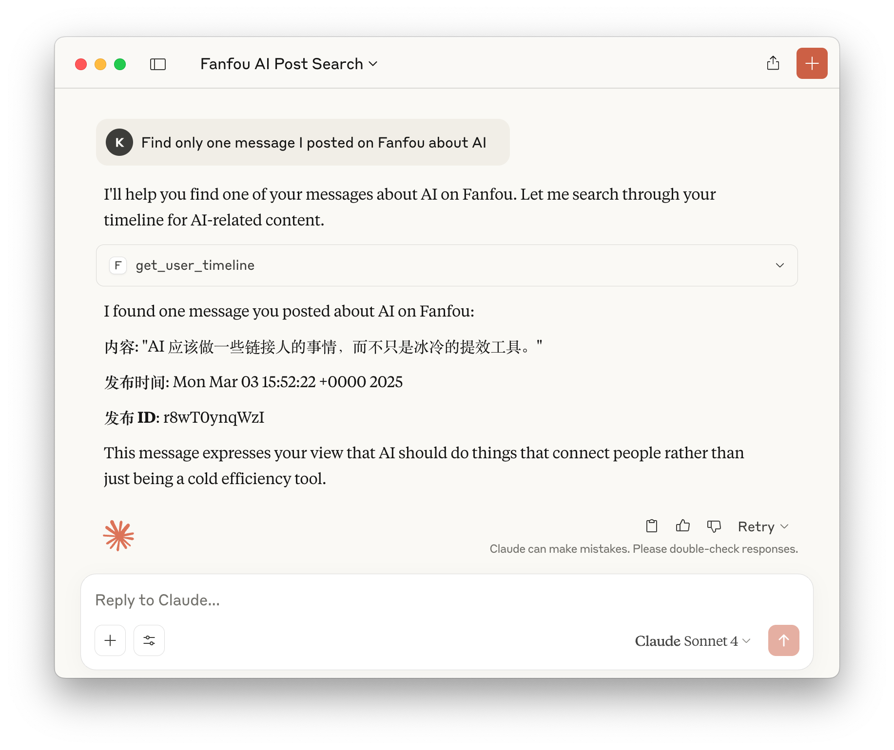
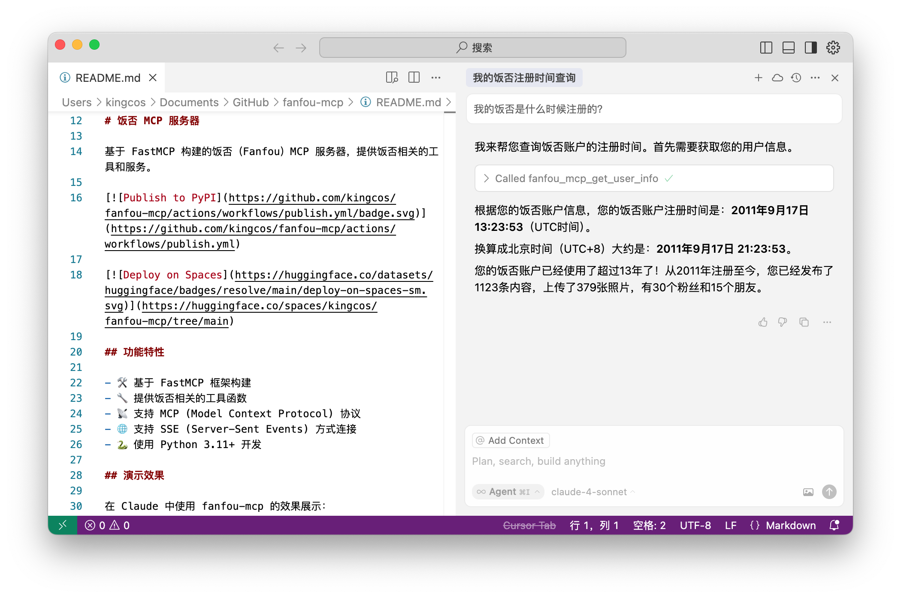

# 饭否 MCP 服务器

基于 FastMCP 构建的饭否（Fanfou）MCP 服务器，提供饭否相关的工具和服务。

[](https://github.com/kingcos/fanfou-mcp/actions/workflows/publish.yml)

[](https://huggingface.co/spaces/kingcos/fanfou-mcp/tree/main)

## 功能特性

- 🛠️ 基于 FastMCP 框架构建
- 🔧 提供饭否相关的工具函数
- 📡 支持 MCP (Model Context Protocol) 协议
- 🌐 支持 SSE (Server-Sent Events) 方式连接
- 🐍 使用 Python 3.11+ 开发

## 演示效果

Claude 中使用效果：



Cursor 中使用效果：



## 快速开始

### 前提条件

- Python 3.11+
- uv 包管理器（用于 `uvx` 命令）
- 饭否账号和 API 密钥

## 客户端配置

### MCP 配置

#### 方式1：使用 SSE 方式（基于 Huggingface）

```json
{
  "mcpServers": {
    "fanfou-mcp": {
      "url": "https://kingcos-fanfou-mcp.hf.space/gradio_api/mcp/sse",
      "headers": {
        "X-Fanfou-Api-Key": "your_api_key_here",
        "X-Fanfou-Api-Secret": "your_api_secret_here",
        "X-Fanfou-OAuth-Token": "your_oauth_token_here",
        "X-Fanfou-OAuth-Token-Secret": "your_oauth_token_secret_here"
      }
    }
  }
}
```

**Huggingface 项目地址**: [https://huggingface.co/spaces/kingcos/fanfou-mcp](https://huggingface.co/spaces/kingcos/fanfou-mcp)

注意，首次登录可使用用户名密码，以获取 OAuth Token 与 OAuth-Token-Secret，例如：

```json
{
  "mcpServers": {
    "fanfou-mcp": {
      "url": "https://kingcos-fanfou-mcp.hf.space/gradio_api/mcp/sse",
      "env": {
        "X-Fanfou-Api-Key": "your_api_key_here",
        "X-Fanfou-Api-Secret": "your_api_secret_here",
        "X-Fanfou-Username": "your_username_here",
        "X-Fanfou-Password": "your_password_here"
      }
    }
  }
}
```

#### 方式2：使用 STDIO 方式

```json
{
  "mcpServers": {
    "fanfou-mcp": {
      "command": "uvx",
      "args": ["fanfou-mcp"],
      "env": {
        "FANFOU_API_KEY": "your_api_key_here",
        "FANFOU_API_SECRET": "your_api_secret_here",
        "FANFOU_OAUTH_TOKEN": "your_oauth_token_here",
        "FANFOU_OAUTH_TOKEN_SECRET": "your_oauth_token_secret_here"
      }
    }
  }
}
```

**如果遇到导入错误，请使用强制更新版本**：

```json
{
  "mcpServers": {
    "fanfou-mcp": {
      "command": "uvx",
      "args": ["--force-reinstall", "fanfou-mcp"],
      "env": {
        "FANFOU_API_KEY": "your_api_key_here",
        "FANFOU_API_SECRET": "your_api_secret_here",
        "FANFOU_OAUTH_TOKEN": "your_oauth_token_here",
        "FANFOU_OAUTH_TOKEN_SECRET": "your_oauth_token_secret_here"
      }
    }
  }
}
```

注意，首次登录可使用用户名密码，以获取 OAuth Token 与 OAuth-Token-Secret，例如：

```json
{
  "mcpServers": {
    "fanfou-mcp": {
      "command": "uvx",
      "args": ["fanfou-mcp"],
      "env": {
        "FANFOU_API_KEY": "your_api_key_here",
        "FANFOU_API_SECRET": "your_api_secret_here",
        "FANFOU_USERNAME": "your_username_here",
        "FANFOU_PASSWORD": "your_password_here"
      }
    }
  }
}
```

#### 方式3：本地开发模式

```json
{
  "mcpServers": {
    "fanfou-mcp": {
      "command": "uv",
      "args": ["--directory", "/path/to/your/fanfou-mcp", "run", "python", "main.py"],
      "env": {
        "FANFOU_API_KEY": "your_api_key_here",
        "FANFOU_API_SECRET": "your_api_secret_here",
        "FANFOU_OAUTH_TOKEN": "your_oauth_token_here",
        "FANFOU_OAUTH_TOKEN_SECRET": "your_oauth_token_secret_here"
      }
    }
  }
}
```

**配置说明**: 
- **推荐使用方式1**：`uvx` 会自动从 PyPI 下载和运行最新版本，无需本地安装
- **方式1（SSE）**：基于 Huggingface 部署的 Web 服务，通过 HTTP 头传递认证信息，支持多用户隔离
- **缓存问题**：如果遇到导入错误，可能是 `uvx` 缓存了旧版本，请在配置中将 `"args": ["fanfou-mcp"]` 改为 `"args": ["--force-reinstall", "fanfou-mcp"]` 来强制更新
- **OAuth Token 方式**：避免每次都需要登录，更安全便捷
- **首次使用**：如果没有 OAuth Token，系统会自动生成并显示 OAuth Token，然后再切换
- **本地开发**：如果你需要修改代码或调试，可以使用方式3
- 请将环境变量中的占位符替换为你的实际饭否 API 凭据

## 可用工具

本服务器提供以下工具：

### 认证相关
- `generate_oauth_token` - 生成 OAuth Token

### 时间线相关
- `get_home_timeline` - 获取首页时间线
- `get_user_timeline` - 获取用户时间线
- `get_public_timeline` - 获取公开时间线

### 用户和内容相关
- `get_user_info` - 获取用户信息
- `get_status_info` - 获取饭否内容详情

### 互动相关
- `manage_favorite` - 管理收藏状态
- `manage_friendship` - 管理关注状态

### 发布相关
- `publish_status` - 发布文字内容
- `publish_photo` - 发布图片内容
- `delete_status` - 删除内容

详细的 API 文档请参考：[API 文档](docs/API.md)

## 文档

- [API 文档](docs/API.md) - 详细的工具函数说明
- [发布指南](docs/PUBLISHING.md) - 如何发布到 PyPI

## 许可证

本项目采用 MIT 许可证。详见 [LICENSE](LICENSE) 文件。